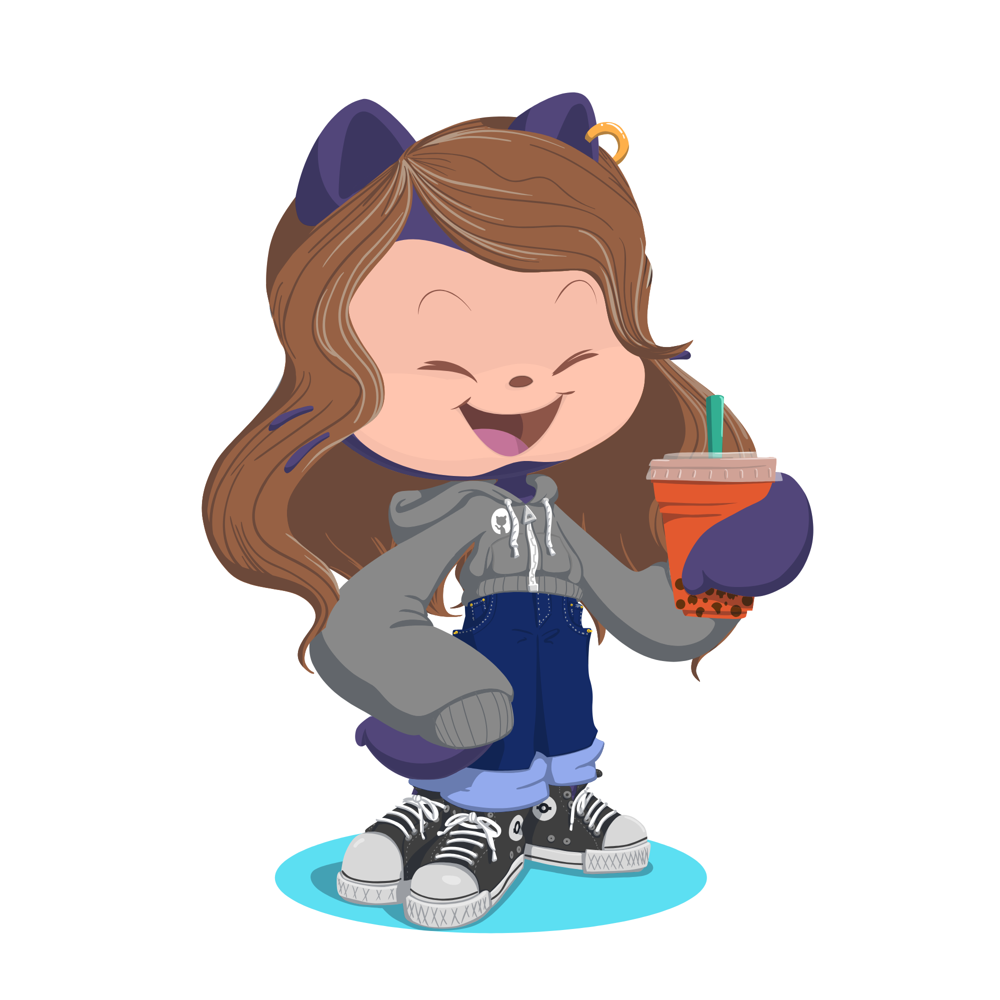

<p align="center">
  
</p>

### 💻 Estudiante de Desarrollo de Aplicaciones Web · 2º DAW

Soy estudiante de **2º de Desarrollo de Aplicaciones Web (DAW)**, interesada en el mundo del desarrollo de software y especialmente en la creación de aplicaciones web.

Actualmente estoy ampliando mis conocimientos tanto en **desarrollo web frontend como backend**, trabajando con diferentes tecnologías y herramientas y aprendiendo a desarrollar proyectos cada vez más estructurados, mantenibles y profesionales.

---

## 🛠️ Tecnologías y herramientas

### 💻 Lenguajes y tecnologías

<p align="center">
  
</p>

### ⚙️ Herramientas

<p align="center">
  
</p>


---

## 🌐 En qué estoy trabajando

Durante mi formación estoy trabajando principalmente en:

* 🐘 **PHP y desarrollo web en entorno servidor**
* 🌐 **HTML, CSS y JavaScript**
* ☕ **Programación con Java**
* 🗄️ **Bases de datos y SQL**
* 🐍 **Python**
* 🔀 **Git y GitHub**
* 🖥️ **Servidores locales y entornos de desarrollo**
* 🔐 **Conceptos de redes, sistemas y seguridad**
* 🤖 **Inteligencia artificial y automatización**
* 📦 **Organización y documentación de proyectos**

---

## 🧠 Soft Skills

Más allá de la parte técnica, considero importantes:

* 🔎 **Curiosidad** — me gusta entender cómo funcionan las cosas.
* 🧩 **Resolución de problemas** — intento dividir los problemas complejos en partes más sencillas.
* 📚 **Aprendizaje continuo** — estoy constantemente aprendiendo nuevas herramientas y tecnologías.
* 💡 **Creatividad** — me gusta buscar diferentes formas de plantear y resolver un problema.
* 🤝 **Trabajo en equipo** — considero importante saber comunicar ideas y colaborar con otras personas.
* 🎯 **Responsabilidad** — intento mantener una buena organización y cumplir con los objetivos de cada proyecto.
* 🔄 **Adaptabilidad** — me interesa aprender tecnologías nuevas y enfrentarme a problemas que todavía no sé resolver.

---

## 🔭 Intereses tecnológicos

Me interesa especialmente seguir explorando:

**Desarrollo web · Backend · Frontend · Inteligencia artificial · Automatización · Ciberseguridad · Big data · Nuevas tecnologías**

Mi objetivo es seguir construyendo una base técnica sólida y descubrir qué áreas del desarrollo web encajan mejor conmigo a medida que adquiera experiencia.

---

## 📈 Actualmente aprendiendo

```text
PHP                 █████████░░  En desarrollo
Java                ████████░░░  En desarrollo
HTML / CSS          █████████░░  En desarrollo
JavaScript          ███████░░░░  En desarrollo
SQL / Bases de datos███████░░░░  En desarrollo
Python              ██████░░░░░  En desarrollo
Git / GitHub        ████████░░░  En desarrollo
```

> Las barras representan únicamente mi progreso dentro de mi formación actual, no un nivel profesional.

---

## 🎯 Objetivo

Seguir creciendo como desarrolladora, convertir los conocimientos adquiridos durante el ciclo en **proyectos reales** y construir poco a poco un portfolio que refleje mi evolución.

Este GitHub es también una forma de documentar ese proceso.
---

<p align="center">
  <i>Gracias por pasarte ! 💻✨</i>
</p>

<p align="right">
  
</p>
---
## 📬 Contacto

<p align="center">
  <a href="https://github.com/lauraa-016">
    
  </a>
  &nbsp;&nbsp;&nbsp;
  <a href="mailto:lauradelamata15@gmail.com">
    
  </a>
</p>

<p align="center">
  <sub>GitHub · Email</sub>
</p>

